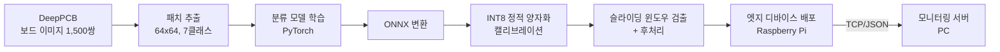
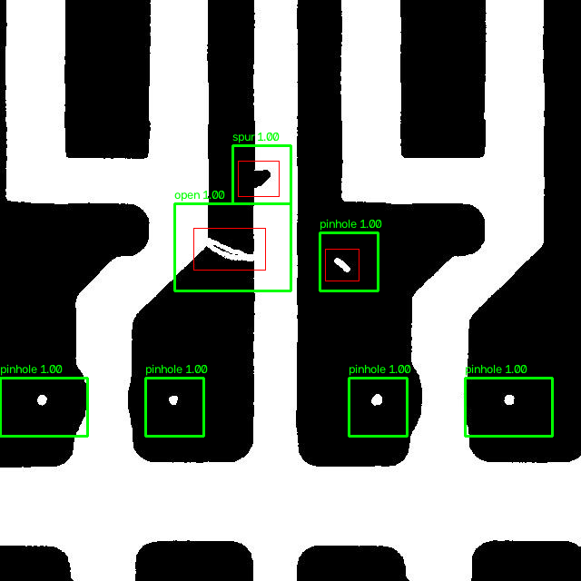

# 온디바이스 PCB 결함 검사 (On-device PCB Defect Inspection)

PCB 표면 결함(open, short, mousebite, spur, copper, pin-hole) 6종을 엣지 디바이스에서 직접 검출하는 것을 목표로,
**데이터셋 구축 → 모델 학습 → 경량화(ONNX + INT8 양자화) → 보드 단위 검출(후처리) → 임베디드 배포/모니터링**까지
온디바이스 AI 개발 사이클 전체를 직접 구현해본 프로젝트입니다.


> 초록 박스: 모델 검출 결과 / 빨강 박스: 정답(어노테이션) — 테스트 보드의 정답 결함 9개를 모두 검출 (MobileNetV2 INT8, 보드 1장당 약 0.2초)

## 왜 이 프로젝트를 했나

AI 모델을 학습시키는 것까지는 강의나 캐글로 여러 번 해봤지만, 만든 모델이 실제 장비에서
돌아가게 만드는 과정은 경험해본 적이 없었습니다. 검사 장비처럼 서버로 이미지를 보낼 수 없거나
(보안, 네트워크 비용) 판정 지연이 곧 생산성인 환경에서는 디바이스 위에서 바로 추론하는 구조가
필요한데, 그러려면 모델 정확도만이 아니라 모델 크기, 추론 속도, 배포 포맷까지 같이 고민해야
한다는 걸 이 프로젝트를 하면서 배웠습니다.

그래서 "학습된 모델"이 아니라 **"엣지 디바이스에서 돌아가는 검사 파이프라인"** 을 최종 결과물로 잡았습니다.

## 전체 파이프라인



## 1. 데이터셋 구축

[DeepPCB](https://github.com/tangsanli5201/DeepPCB) 데이터셋을 사용했습니다.
640x640 흑백 PCB 이미지 1,500쌍에 결함 위치(박스)와 종류가 어노테이션되어 있고,
공식 분할(학습 1,000 / 테스트 500)을 그대로 따랐습니다.

보드 한 장을 통째로 분류할 수는 없어서, 결함 박스를 중심으로 64x64 패치를 잘라
분류용 데이터셋을 만들었습니다. 정상 패치는 결함과 겹치지 않는 위치에서 랜덤 크롭했습니다.
결함 박스 크기를 확인해보니 평균 39x36px이고 94%가 64px 안에 들어와서 패치 크기는 64로 정했습니다.
(자세한 분석: [notebooks/01_dataset_check.ipynb](notebooks/01_dataset_check.ipynb))

한 가지 중요한 디테일: 결함 패치를 자를 때 크롭 위치에 **±16px 랜덤 오프셋**을 줬습니다.
처음에는 결함이 항상 정중앙에 오게 잘랐는데, 그렇게 학습한 모델은 슬라이딩 윈도우 추론에서
결함이 윈도우 가장자리에 걸리면 확신도가 뚝 떨어지는 문제가 있었습니다. (아래 4번 섹션 참고)

| 구분 | 정상 | open | short | mousebite | spur | copper | pinhole | 합계 |
|---|---|---|---|---|---|---|---|---|
| 학습 | 6,000 | 1,283 | 1,028 | 1,379 | 1,142 | 1,010 | 1,031 | 12,873 |
| 테스트 | 3,000 | 659 | 478 | 586 | 483 | 464 | 470 | 6,140 |

```bash
git clone https://github.com/tangsanli5201/DeepPCB.git data/DeepPCB
python data/prepare_patches.py
```

## 2. 모델 학습

엣지 배포가 목표라서 처음부터 작은 모델 위주로 두 가지를 같은 조건에서 비교했습니다.

- **SimpleCNN**: 직접 설계한 3-conv 블록 CNN (55만 파라미터, 흑백 1채널 입력)
- **MobileNetV2**: 대표적인 경량 아키텍처 (223만 파라미터, torchvision 구현, 스크래치 학습)

| 모델 | 파라미터 | 테스트 정확도 (패치) | 비고 |
|---|---|---|---|
| SimpleCNN | 0.55M | 92.8% | 직접 설계 |
| MobileNetV2 | 2.23M | **96.0%** | torchvision, 스크래치 학습 |

(30 epochs, Adam 1e-3 + StepLR, flip 증강. 사전학습 가중치는 쓰지 않았습니다 —
이진화된 PCB 패턴은 ImageNet과 도메인이 많이 달라서, 두 모델을 같은 스크래치 조건에서 비교했습니다.)


MobileNetV2가 3.2%p 앞섰습니다. confusion matrix를 보면 결함 종류끼리 헷갈리는 경우보다
**정상↔결함 경계에서 틀리는 경우**가 대부분입니다. 정상 패치를 short로 잘못 보는 경우(39건)가
가장 많은데, 배선이 촘촘한 구간은 정상 연결부도 short처럼 보일 수 있기 때문으로 보입니다.
반대로 spur, mousebite처럼 배선 가장자리의 작은 돌기/파임 결함은 정상 패턴의 일부로
놓치기 쉬웠습니다. SimpleCNN의 결과는 `results/curves_simple_cnn.png`,
`results/confusion_matrix_simple_cnn.png` 참고.

```bash
python src/train.py --model simple_cnn --epochs 30
python src/train.py --model mobilenet_v2 --epochs 30
python src/evaluate.py --model simple_cnn
```

## 3. 경량화: ONNX 변환 + INT8 정적 양자화

NPU 같은 엣지 AI 가속기는 대부분 INT8 연산이 기본이고, 프레임워크에 종속되지 않는
모델 포맷이 필요합니다. 그래서 실제 NPU 배포 흐름과 비슷하게
**PyTorch → ONNX 변환 → 캘리브레이션 기반 INT8 정적 양자화** 순서로 진행했습니다.

정적 양자화는 학습 패치 300장을 캘리브레이션 데이터로 흘려보내 각 레이어 활성값 범위를
측정한 뒤 스케일을 결정하는 방식입니다. (QDQ 포맷, per-channel)

| 모델 | 크기 | 테스트 정확도 | 패치 1장 지연시간* |
|---|---|---|---|
| SimpleCNN FP32 | 2.11 MB | 92.8% | 0.14 ms |
| SimpleCNN INT8 | **0.55 MB** | 93.1% | 0.64 ms |
| MobileNetV2 FP32 | 8.69 MB | 96.0% | 0.72 ms |
| MobileNetV2 INT8 | **2.61 MB** | 96.1% | 1.60 ms |

*x86 4코어 CPU(개발 환경) 기준. `src/benchmark.py`로 측정 (warmup 20회 + 200회 평균)

여기서 배운 것 두 가지:

1. **정확도는 거의 그대로였습니다.** 오히려 두 모델 다 0.1~0.3%p 올랐는데, 양자화 노이즈가
   약한 정규화처럼 작용한 것으로 보입니다. per-channel 양자화 덕도 있는 것 같습니다.
2. **x86 CPU에서는 INT8이 오히려 느렸습니다.** 처음엔 당황했는데, 찾아보니 x86은 FP32
   SIMD(AVX)가 워낙 빠르고 QDQ 노드의 변환 오버헤드가 있어 자주 있는 일이었습니다.
   INT8의 속도·전력 이득은 결국 ARM(NEON)이나 NPU 같은 정수 연산에 최적화된 하드웨어에서
   나온다는 것 — 엣지 AI에 전용 NPU가 필요한 이유를 벤치마크로 직접 확인한 셈입니다.

```bash
python src/export_onnx.py --model simple_cnn
python src/quantize_onnx.py --model simple_cnn
python src/benchmark.py --models models/simple_cnn_fp32.onnx models/simple_cnn_int8.onnx
```

## 4. 보드 단위 결함 검출 (후처리)

패치 분류기를 실제 검사에 쓰려면 "보드 한 장에서 결함이 어디에 있는지"를 찾아야 합니다.
64x64 윈도우를 stride 32로 훑으면서 배치 추론하고, 결함으로 판정된 인접 윈도우를
connected components로 묶어 결함 박스와 종류를 출력하는 후처리를 구현했습니다.


- 640x640 보드 1장 = 윈도우 361개 → 배치 추론 약 0.2~0.4초 (MobileNetV2 INT8, x86 CPU)

보드 단위 성능은 패치 정확도와 별개로 평가해야 해서, 테스트 보드 100장에 대해
recall(정답 결함 중 찾은 비율)과 precision(검출 중 실제 결함 비율)을 재는
`deploy/eval_detection.py`를 만들었습니다. (정답 박스 면적의 50% 이상이 덮이면 검출로 인정)

| 모델 (INT8) | thresh | recall (위치) | recall (위치+종류) | precision |
|---|---|---|---|---|
| MobileNetV2 | 0.8 | **97.9%** | **96.2%** | 76.2% |
| MobileNetV2 | 0.6 | 99.1% | 97.4% | 70.1% |
| SimpleCNN | 0.6 | 95.4% | 92.1% | 67.2% |

검사 현장에서는 불량 유출(미검출)이 재검사(오검출)보다 훨씬 치명적이라
recall을 우선하는 임계값을 기본값으로 잡았습니다.

```bash
python deploy/eval_detection.py --onnx models/mobilenet_v2_int8.onnx --num-boards 100
```

### 삽질 기록: 패치 정확도는 96%인데 보드에서는 결함을 놓친다?

처음 만든 모델은 패치 테스트 정확도가 96%였는데, 정작 보드 전체를 슬라이딩 윈도우로 훑으면
결함을 절반 가까이 놓쳤습니다. 놓친 결함들을 보니 공통점이 있었습니다 — 확신도가 0.5~0.6에
몰려 있고, 대부분 윈도우 가장자리에 결함이 걸린 경우였습니다.

원인은 학습 데이터였습니다. 패치를 결함 중심으로만 잘랐기 때문에 모델은 "가운데에 결함이 있는
그림"만 배웠고, 슬라이딩 윈도우처럼 결함이 아무 위치에나 나타나는 상황은 처음 보는 분포였던 겁니다.
stride 32로 훑으면 결함 중심이 윈도우 중심에서 최대 ±16px 벗어날 수 있어서, 패치 추출 시
크롭 위치에 ±16px 랜덤 오프셋을 주고 다시 학습했습니다.

| | 패치 정확도 | 보드 recall (위치) | 보드 recall (위치+종류) |
|---|---|---|---|
| 중심 정렬 패치로 학습 | 95.7% | 47.9% | 38.9% |
| ±16px 오프셋 패치로 학습 | 92.8% | **95.4%** | **92.1%** |

*SimpleCNN INT8, thresh 0.6, 테스트 보드 100장 동일 조건 비교*

패치 정확도는 3%p 떨어졌지만(문제가 더 어려워졌으니 당연한 결과), 정작 중요한 보드 단위
recall은 48%에서 95%로 뛰었습니다.

패치 정확도만 보고 있었으면 못 찾았을 문제라서, "모델 지표"와 "시스템 지표"를 분리해서
봐야 한다는 걸 배웠습니다.

```bash
python deploy/detect_board.py --image data/DeepPCB/PCBData/group00041/00041/00041000_test.jpg \
    --annot data/DeepPCB/PCBData/group00041/00041_not/00041000.txt
```

## 5. 임베디드 배포 & 모니터링

검사 장비(라즈베리파이)가 판정하고, 결과만 TCP(JSON)로 관리 PC에 보내는 구조를 가정했습니다.
이미지 원본이 아니라 판정 결과만 네트워크로 나가기 때문에 대역폭 부담이 거의 없습니다.

```
[Raspberry Pi + 카메라]                     [관리 PC]
  camera_demo.py  ──── TCP/JSON ────>  monitor_server.py
  (추론 + 후처리)                        (수신/로그/콘솔 표시)
```

```bash
# PC에서
python deploy/monitor_server.py --port 5000

# 라즈베리파이에서 (같은 네트워크)
python deploy/camera_demo.py --send <PC_IP>:5000
```

라즈베리파이에는 `pip install onnxruntime opencv-python` 만 설치하면 되고
(PyTorch 불필요 — 학습 환경과 배포 환경의 의존성 분리),
`src/benchmark.py`를 그대로 실행하면 동일 조건 벤치마크를 얻을 수 있습니다.

용도별 기본 모델은 다르게 잡았습니다.

- `detect_board.py` (정밀 검사): **MobileNetV2 INT8** — 정확도 우선
- `camera_demo.py` (실시간 데모): **SimpleCNN INT8** — 프레임 속도 우선 (2.5배 빠름, 크기 1/5)

파이썬을 설치할 수 없는 장비를 대비해서, 추론과 후처리를 **ONNX Runtime C++ API로
포팅한 데모**도 만들었습니다 ([deploy/cpp](deploy/cpp)). 같은 보드에서 파이썬 버전과
동일한 검출 결과가 나오는 것까지 확인했습니다.

## 실행 방법 (전체)

```bash
git clone <이 저장소>
cd ondevice-pcb-inspection
pip install -r requirements.txt

git clone https://github.com/tangsanli5201/DeepPCB.git data/DeepPCB
python data/prepare_patches.py            # 1. 패치 추출
python src/train.py --model simple_cnn --epochs 30   # 2. 학습
python src/evaluate.py --model simple_cnn # 3. 평가
python src/export_onnx.py --model simple_cnn   # 4. ONNX 변환
python src/quantize_onnx.py --model simple_cnn # 5. INT8 양자화
python src/benchmark.py --models models/simple_cnn_fp32.onnx models/simple_cnn_int8.onnx
python deploy/detect_board.py --image <보드 이미지>  # 6. 보드 검출
```

학습을 생략하고 싶으면 저장소에 포함된 `models/*.onnx`로 4~6단계만 바로 실행할 수 있습니다.

## 한계와 개선 계획

- **정상 구조물 오검출**: 아래처럼 보드에 원래 있는 비아 홀(하얀 점)을 pinhole 결함으로
  잡는 경우가 있습니다. 패치만 보고는 "설계상 있어야 할 홀"인지 알 수 없기 때문입니다.
  DeepPCB에는 결함 없는 템플릿 이미지가 쌍으로 있어서, 템플릿과 비교(차분)하는 단계를
  붙이면 이런 오검출을 크게 줄일 수 있을 것 같습니다. (precision이 recall보다 낮은 주된 원인)

  

- **큰 결함**: 결함 박스의 6.5%는 64px를 넘어서 패치 하나에 다 안 담깁니다. 인접 윈도우
  묶기로 어느 정도 커버되지만, 근본적으로는 멀티스케일 패치가 필요합니다.
- **슬라이딩 윈도우 중복 연산**: stride 32면 인접 윈도우끼리 절반씩 겹칩니다. 분류기를
  FCN 형태로 바꿔 보드 전체를 한 번에 추론하면 훨씬 빨라질 것 같습니다.
- **실제 NPU 포팅**: 지금은 ONNX Runtime CPU까지 검증했습니다. INT8 모델을 실제 NPU에
  올려 컴파일하면 양자화 정확도/속도가 어떻게 달라지는지 확인해보고 싶습니다.
  (x86에서 INT8이 더 느렸던 것처럼, 하드웨어가 바뀌면 결과가 달라진다는 걸 배웠기 때문에)
- **보드 단위 정식 평가**: 지금은 커버리지 기반 자체 지표인데, DeepPCB 공식 평가 스크립트
  (mAP/F-score)로도 측정해서 논문 벤치마크와 비교해보고 싶습니다.
