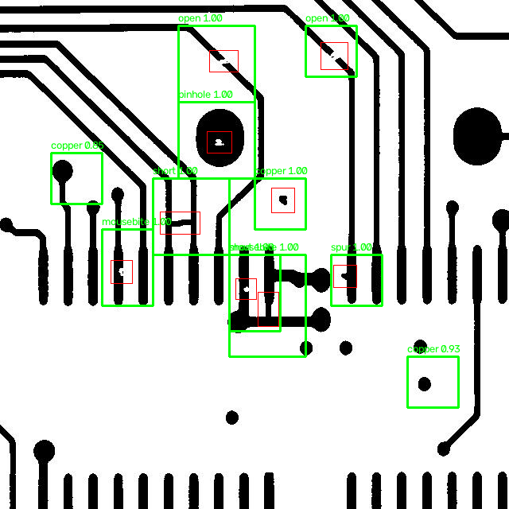
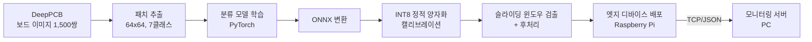
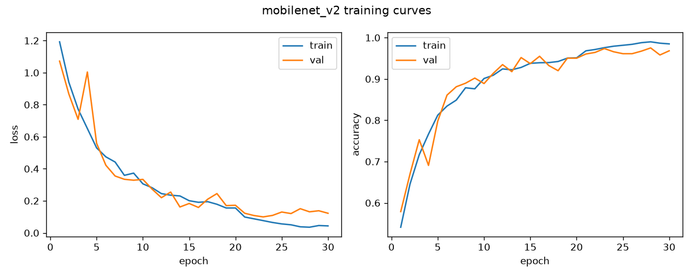
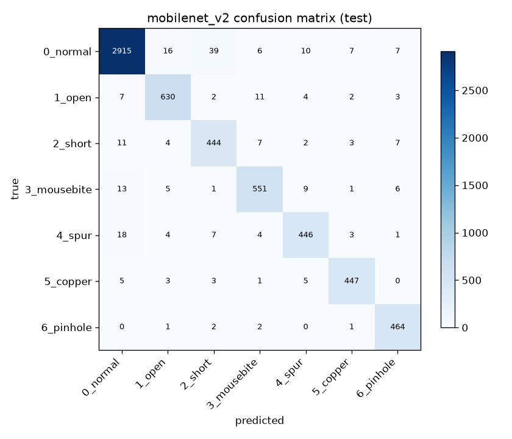
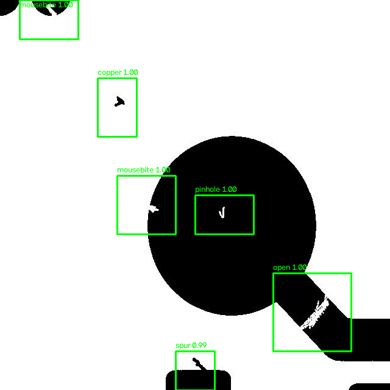
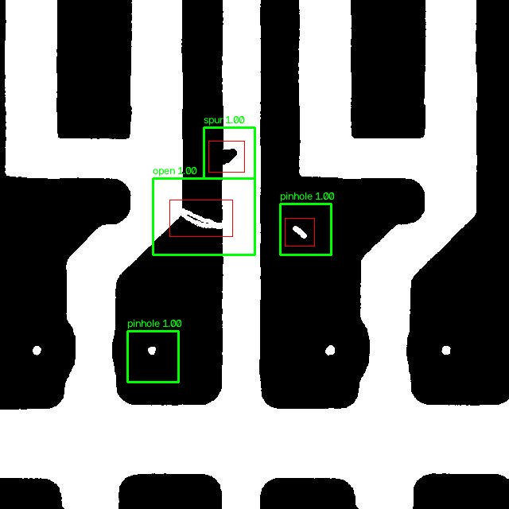

# 온디바이스 PCB 결함 검사 (On-device PCB Defect Inspection)

PCB 표면 결함(open, short, mousebite, spur, copper, pin-hole) 6종을 엣지 디바이스에서 직접 검출하는 것을 목표로,
**데이터셋 구축 → 모델 학습 → 경량화(ONNX + INT8 양자화) → 보드 단위 검출(후처리) → 임베디드 배포/모니터링**까지
온디바이스 AI 개발 사이클 전체를 직접 구현해본 프로젝트입니다.



> 초록 박스: 모델 검출 결과 / 빨강 박스: 정답(어노테이션) — 테스트 보드의 정답 결함 9개를 모두 검출 (MobileNetV2 INT8, 보드 1장당 약 0.2초)

## 왜 이 프로젝트를 했나

AI 모델을 학습시키는 것까지는 강의나 캐글로 여러 번 해봤지만, 만든 모델이 실제 장비에서
돌아가게 만드는 과정은 경험해본 적이 없었습니다. 검사 장비처럼 서버로 이미지를 보낼 수 없거나
(보안, 네트워크 비용) 판정 지연이 곧 생산성인 환경에서는 디바이스 위에서 바로 추론하는 구조가
필요한데, 그러려면 모델 정확도만이 아니라 모델 크기, 추론 속도, 배포 포맷까지 같이 고민해야
한다는 걸 이 프로젝트를 하면서 배웠습니다.

그래서 "학습된 모델"이 아니라 **"엣지 디바이스에서 돌아가는 검사 파이프라인"** 을 최종 결과물로 잡았습니다.

## 전체 파이프라인



## 1. 데이터셋 구축

[DeepPCB](https://github.com/tangsanli5201/DeepPCB) 데이터셋을 사용했습니다.
640x640 흑백 PCB 이미지 1,500쌍에 결함 위치(박스)와 종류가 어노테이션되어 있고,
공식 분할(학습 1,000 / 테스트 500)을 그대로 따랐습니다.

보드 한 장을 통째로 분류할 수는 없어서, 결함 박스를 중심으로 64x64 패치를 잘라
분류용 데이터셋을 만들었습니다. 정상 패치는 결함과 겹치지 않는 위치에서 랜덤 크롭했습니다.
결함 박스 크기를 확인해보니 평균 39x36px이고 94%가 64px 안에 들어와서 패치 크기는 64로 정했습니다.
(자세한 분석: [notebooks/01_dataset_check.ipynb](notebooks/01_dataset_check.ipynb))

한 가지 중요한 디테일: 결함 패치를 자를 때 크롭 위치에 **±16px 랜덤 오프셋**을 줬습니다.
처음에는 결함이 항상 정중앙에 오게 잘랐는데, 그렇게 학습한 모델은 슬라이딩 윈도우 추론에서
결함이 윈도우 가장자리에 걸리면 확신도가 뚝 떨어지는 문제가 있었습니다. (아래 4번 섹션 참고)

| 구분 | 정상 | open | short | mousebite | spur | copper | pinhole | 합계 |
|---|---|---|---|---|---|---|---|---|
| 학습 | 6,000 | 1,283 | 1,028 | 1,379 | 1,142 | 1,010 | 1,031 | 12,873 |
| 테스트 | 3,000 | 659 | 478 | 586 | 483 | 464 | 470 | 6,140 |

```bash
git clone https://github.com/tangsanli5201/DeepPCB.git data/DeepPCB
python data/prepare_patches.py
```

## 2. 모델 학습

엣지 배포가 목표라서 처음부터 작은 모델 위주로 두 가지를 같은 조건에서 비교했습니다.

- **SimpleCNN**: 직접 설계한 3-conv 블록 CNN (55만 파라미터, 흑백 1채널 입력)
- **MobileNetV2**: 대표적인 경량 아키텍처 (223만 파라미터, torchvision 구현, 스크래치 학습)

| 모델 | 파라미터 | 테스트 정확도 (패치) | 비고 |
|---|---|---|---|
| SimpleCNN | 0.55M | 92.8% | 직접 설계 |
| MobileNetV2 | 2.23M | **96.0%** | torchvision, 스크래치 학습 |

(30 epochs, Adam 1e-3 + StepLR, flip 증강. 사전학습 가중치는 쓰지 않았습니다 —
이진화된 PCB 패턴은 ImageNet과 도메인이 많이 달라서, 두 모델을 같은 스크래치 조건에서 비교했습니다.)





MobileNetV2가 3.2%p 앞섰습니다. confusion matrix를 보면 결함 종류끼리 헷갈리는 경우보다
**정상↔결함 경계에서 틀리는 경우**가 대부분입니다. 정상 패치를 short로 잘못 보는 경우(39건)가
가장 많은데, 배선이 촘촘한 구간은 정상 연결부도 short처럼 보일 수 있기 때문으로 보입니다.
반대로 spur, mousebite처럼 배선 가장자리의 작은 돌기/파임 결함은 정상 패턴의 일부로
놓치기 쉬웠습니다. SimpleCNN의 결과는 `results/curves_simple_cnn.png`,
`results/confusion_matrix_simple_cnn.png` 참고.

```bash
python src/train.py --model simple_cnn --epochs 30
python src/train.py --model mobilenet_v2 --epochs 30
python src/evaluate.py --model simple_cnn
```

## 3. 경량화: ONNX 변환 + INT8 정적 양자화

NPU 같은 엣지 AI 가속기는 대부분 INT8 연산이 기본이고, 프레임워크에 종속되지 않는
모델 포맷이 필요합니다. 그래서 실제 NPU 배포 흐름과 비슷하게
**PyTorch → ONNX 변환 → 캘리브레이션 기반 INT8 정적 양자화** 순서로 진행했습니다.

정적 양자화는 학습 패치 300장을 캘리브레이션 데이터로 흘려보내 각 레이어 활성값 범위를
측정한 뒤 스케일을 결정하는 방식입니다. (QDQ 포맷, per-channel)

| 모델 | 크기 | 테스트 정확도 | 패치 1장 지연시간* |
|---|---|---|---|
| SimpleCNN FP32 | 2.11 MB | 92.8% | 0.33 ms |
| SimpleCNN INT8 | **0.55 MB** | 93.1% | 0.69 ms |
| MobileNetV2 FP32 | 8.69 MB | 96.0% | 1.39 ms |
| MobileNetV2 INT8 | **2.61 MB** | 96.0% | 2.12 ms |

*Intel 2코어 노트북(macOS)에서 실측. `src/benchmark.py`로 측정 (warmup 20회 + 200회 평균)

여기서 배운 것 두 가지:

1. **정확도는 거의 그대로였습니다.** MobileNetV2는 0.03%p 하락, SimpleCNN은 오히려 0.28%p
   올랐습니다. per-channel 양자화를 쓴 덕에 손실이 거의 없었던 것으로 보입니다.
2. **x86 CPU에서는 INT8이 오히려 느렸습니다.** 처음엔 당황했는데, 찾아보니 x86은 FP32
   SIMD(AVX)가 워낙 빠르고 QDQ 노드의 변환 오버헤드가 있어 자주 있는 일이었습니다.
   INT8의 속도·전력 이득은 결국 ARM(NEON)이나 NPU 같은 정수 연산에 최적화된 하드웨어에서
   나온다는 것 — 엣지 AI에 전용 NPU가 필요한 이유를 벤치마크로 직접 확인한 셈입니다.

```bash
python src/export_onnx.py --model simple_cnn
python src/quantize_onnx.py --model simple_cnn
python src/benchmark.py --models models/simple_cnn_fp32.onnx models/simple_cnn_int8.onnx
```

### PTQ vs QAT: 양자화 인식 학습이 도움이 될까

여기까지는 PTQ(학습 후 양자화)만 썼습니다. 학습이 끝난 모델을 나중에 INT8로 바꾸는 방식이라
간단하지만, 모델은 양자화 오차를 모른 채 학습됩니다. 이론적으로는 학습 중에 가짜 양자화
노드를 넣는 **QAT(양자화 인식 학습)**가 더 유리하다고 해서 직접 비교해봤습니다.

처음 결과는 QAT가 PTQ보다 0.71%p 높게 나왔습니다. 그런데 생각해보니 QAT는 3 epoch를
**추가로 학습**한 것이라 공정한 비교가 아니었습니다. 그래서 **같은 조건(3 epoch, lr 1e-4)으로
FP32만 파인튜닝한 대조군**을 만들어 다시 비교했습니다.

| 방식 | SimpleCNN 정확도 |
|---|---|
| FP32 (기준) | 92.77% |
| PTQ INT8 | 93.05% |
| FP32 + 3 epoch 파인튜닝 (대조군) | 93.57% |
| **QAT INT8 (3 epoch)** | **93.76%** |

대조군과 비교하면 QAT의 순수 이득은 **+0.19%p**에 그쳤습니다. PTQ에서 이미 정확도 손실이
거의 없었으니 당연한 결과이기도 합니다. **QAT는 PTQ로 정확도가 크게 떨어질 때 쓰는 카드이고,
이 모델에는 추가 복잡도를 감수할 만큼의 이득이 없다**는 결론을 내렸습니다.

처음 수치만 봤으면 "QAT가 더 좋다"고 잘못 결론 낼 뻔했던 실험이라, 비교 조건을 맞추는 게
왜 중요한지 배운 경험이었습니다.

같은 실험을 다른 노트북에서 새로 학습한 체크포인트로 다시 돌려봤습니다. 절대값은 달랐지만
(FP32 93.45% / 대조군 93.06% / QAT INT8 93.22%) **QAT의 순수 이득은 +0.16%p로 거의 같았고,
결론도 그대로였습니다.** 이 재현 실험에서는 3 epoch 추가 학습이 오히려 정확도를 떨어뜨려서
(대조군 -0.39%p) 파인튜닝이 항상 이득은 아니라는 것도 같이 확인했습니다.

```bash
python src/train_qat.py --epochs 3
```

### NPU 컴파일까지 확인해보기

여기까지 하고 나니 "이 모델이 실제 NPU에 올라가긴 하나?"가 궁금했는데, NPU 보드가 없어서
확인할 방법이 없었습니다. 그러다 ARM Ethos-U 계열 NPU의 공식 컴파일러 **Vela**가
하드웨어 없이도 컴파일과 성능 추정을 해준다는 걸 알고 직접 돌려봤습니다.

| 모델 | NPU 연산 배치 | 추정 추론시간 (U55-256) | SRAM | 정확도 (TFLite INT8) |
|---|---|---|---|---|
| SimpleCNN | 10개 **100% NPU** (CPU 폴백 0) | 0.987 ms (1013 FPS) | 85.3 KB | 92.96% |
| MobileNetV2 | 65개 **100% NPU** (CPU 폴백 0) | 4.889 ms (205 FPS) | 124.4 KB | 96.01% |

- 두 모델 다 **CPU 폴백 없이 전부 NPU에 매핑**됐습니다. MobileNetV2의 depthwise conv까지
  지원되는 걸 확인했습니다.
- MAC 유닛을 8배(32→256) 늘려도 속도는 2배가 안 올랐습니다 — **메모리 대역폭이 병목**이라는
  뜻으로, 하드웨어 사양만으로는 한계가 있다는 걸 숫자로 보게 됐습니다.
- ONNX Runtime INT8과 TFLite INT8의 정확도 차이가 0.03~0.22%p로, 툴체인이 달라도 결과가
  거의 같았습니다.

자세한 과정과 전체 비교표: [npu/README.md](npu/README.md)

```bash
pip install -r npu/requirements.txt
python npu/convert_tflite.py --model mobilenet_v2   # ONNX -> INT8 TFLite
python npu/compile_npu.py                          # Vela로 NPU 컴파일 + 성능 비교
python npu/verify_tflite.py --model mobilenet_v2   # 양자화 후 정확도 검증
```

## 4. 보드 단위 결함 검출 (후처리)

패치 분류기를 실제 검사에 쓰려면 "보드 한 장에서 결함이 어디에 있는지"를 찾아야 합니다.
64x64 윈도우를 stride 32로 훑으면서 배치 추론하고, 결함으로 판정된 인접 윈도우를
connected components로 묶어 결함 박스와 종류를 출력하는 후처리를 구현했습니다.



- 640x640 보드 1장 = 윈도우 361개 → 배치 추론 약 0.5초 (MobileNetV2 INT8, Intel 2코어 노트북)

보드 단위 성능은 패치 정확도와 별개로 평가해야 해서, 테스트 보드 100장에 대해
recall(정답 결함 중 찾은 비율)과 precision(검출 중 실제 결함 비율)을 재는
`deploy/eval_detection.py`를 만들었습니다. (정답 박스 면적의 50% 이상이 덮이면 검출로 인정)

| 모델 (INT8) | 후처리 | recall (위치) | recall (위치+종류) | precision |
|---|---|---|---|---|
| MobileNetV2 | 기본 | 97.9% | 96.2% | 76.2% |
| MobileNetV2 | **+ 템플릿 비교** | **97.9%** | **96.1%** | **84.3%** |

(테스트 보드 100장 / 정답 결함 583개 기준, thresh 0.8)

검사 현장에서는 불량 유출(미검출)이 재검사(오검출)보다 훨씬 치명적이라
recall을 우선하는 임계값을 기본값으로 잡았습니다.

#### 오검출 줄이기: 템플릿 비교 후처리

precision이 낮은 주된 원인은 **보드에 원래 있는 비아 홀을 pin-hole 결함으로 오검출**하는 것이었습니다.
패치만 봐서는 "설계상 있어야 할 홀"인지 알 수 없기 때문입니다. DeepPCB는 결함 없는 템플릿
이미지가 쌍으로 제공되므로, 검출 영역을 템플릿과 비교해서 거의 같으면 걸러내도록 했습니다.

처음엔 박스 전체의 차분 비율을 썼는데 잘 안 됐습니다. 검출 박스가 윈도우 단위(64px 배수)라
작은 결함이 큰 박스에 희석되어, 정답(중앙값 3.0%)과 오검출(1.9%)의 분포가 거의 겹쳤습니다.
그래서 **박스를 16x16 블록으로 나눠 가장 많이 다른 블록의 값**을 쓰도록 바꿨더니
정답 32.8% vs 오검출 10.2%로 분리됐고, 임계값 8%에서 정답을 99.7% 유지하면서 오검출을
40% 제거할 수 있었습니다.

| | 검출 수 | recall (위치) | precision |
|---|---|---|---|
| 기본 | 820건 | 97.9% | 76.2% |
| 템플릿 비교 적용 | 740건 | **97.9%** | **84.3%** |



*비아 홀 오검출 3건이 제거된 결과 (적용 전 7건 → 적용 후 4건)*

#### 박스 정밀화와 논문 기준 평가

자체 지표(커버리지)로는 잘 나왔지만, DeepPCB 논문은 **IoU 0.33 이상**을 정검출로 봅니다.
그 기준으로 재보니 recall이 14.8%밖에 안 됐습니다. 원인은 명확했습니다 — 슬라이딩 윈도우
박스는 64px 배수라서 실제 결함(평균 39x36px)보다 훨씬 크고, IoU가 구조적으로 낮게 나옵니다.

그래서 템플릿 차분 영역으로 **박스를 실제 결함 크기까지 좁히는** 후처리를 추가했습니다.
여백(pad)은 정답 어노테이션 스타일에 맞춰 실측으로 정했습니다.

| pad | 0px | 4px | **8px** | 16px | 20px |
|---|---|---|---|---|---|
| 평균 IoU | 0.169 | 0.291 | **0.420** | 0.305 | 0.234 |

| 논문 기준 (IoU≥0.33) | recall (위치) | recall (위치+종류) | precision | F-score |
|---|---|---|---|---|
| 기본 (윈도우 박스) | 14.8% | 14.1% | 10.6% | 12.4% |
| **+ 템플릿 비교 + 박스 정밀화** | **74.3%** | **72.4%** | **68.0%** | **71.0%** |

참고로 DeepPCB 논문의 검출 모델(DIS-YOLO)은 98.6% mAP / 98.2% F-score를 보고합니다.
제 방식은 **분류기 + 후처리** 구조라 박스 정밀도에서 근본적인 차이가 있고, 그만큼 격차가
납니다. 다만 "결함이 있는지, 대략 어디인지"만 필요한 검사 시나리오라면 커버리지 기준
recall 97.9%로 충분히 쓸 수 있다고 봅니다. 정확한 박스가 필요하면 검출 모델로 가야 한다는 걸
숫자로 확인한 셈입니다.

```bash
python deploy/eval_detection.py --onnx models/mobilenet_v2_int8.onnx --num-boards 100
python deploy/eval_detection.py --num-boards 100 --use-template            # 오검출 제거
python deploy/eval_detection.py --num-boards 100 --iou 0.33 --use-template --refine  # 논문 기준
python deploy/detect_board.py --image <보드> --template auto --refine
```

#### 큰 결함 대응: 멀티스케일 검출

결함 크기별로 recall을 나눠 보니 큰 결함에서 성능이 떨어졌습니다. 64x64 윈도우 하나에
결함이 다 안 들어오기 때문입니다.

| 결함 크기 | ~32px | 32~64px | 64~96px | 96px~ |
|---|---|---|---|---|
| 결함 수 | 168 | 1,013 | 85 | 14 |
| recall | 97.6% | 96.4% | 95.3% | **71.4%** |

*테스트 보드 200장 기준 (`deploy/eval_by_size.py`)*

처음에는 96px, 128px 패치로 모델을 다시 학습할 생각이었는데, 그전에 **보드를 절반으로
축소해서 한 번 더 훑는 방법**을 떠올렸습니다. 128px 결함이 축소본에서는 64px로 보이니
같은 모델을 그대로 쓸 수 있습니다. 재학습이 필요 없습니다.

| 결함 크기 | ~32px | 32~64px | 64~96px | 96px~ |
|---|---|---|---|---|
| 단일 스케일 | 97.6% | 96.4% | 95.3% | 71.4% |
| **멀티스케일** | **99.4%** | **98.2%** | **98.8%** | **100.0%** |

전 구간이 좋아졌고 특히 큰 결함은 71.4%(10/14) → 100%(14/14)가 됐습니다.
다만 96px를 넘는 결함이 200장에 14개뿐이라 이 구간 수치는 표본이 작습니다.
그리고 검출 수가 늘어나 precision은 떨어집니다. (같은 결함이 두 스케일에서 잡히는 건 IoU 기반 병합으로 정리했습니다)

| 설정 | recall (위치) | recall (위치+종류) | precision |
|---|---|---|---|
| 기본 | 97.9% | 96.2% | 76.2% |
| + 템플릿 비교 | 97.9% | 96.1% | **84.3%** |
| + 템플릿 비교 + 멀티스케일 | **99.3%** | **97.9%** | 77.7% |

recall과 precision 중 무엇을 우선할지는 현장에 따라 다르므로 옵션으로 두었습니다.
불량 유출이 치명적인 최종 검사라면 멀티스케일을, 재검사 비용이 부담되는 인라인 검사라면
템플릿 비교만 쓰는 식으로 선택할 수 있습니다.

```bash
python deploy/eval_by_size.py --num-boards 200                # 결함 크기별 recall
python deploy/eval_by_size.py --num-boards 200 --multiscale
python deploy/eval_detection.py --num-boards 100 --use-template --multiscale
```

### 삽질 기록: 패치 정확도는 96%인데 보드에서는 결함을 놓친다?

처음 만든 모델은 패치 테스트 정확도가 96%였는데, 정작 보드 전체를 슬라이딩 윈도우로 훑으면
결함을 절반 가까이 놓쳤습니다. 놓친 결함들을 보니 공통점이 있었습니다 — 확신도가 0.5~0.6에
몰려 있고, 대부분 윈도우 가장자리에 결함이 걸린 경우였습니다.

원인은 학습 데이터였습니다. 패치를 결함 중심으로만 잘랐기 때문에 모델은 "가운데에 결함이 있는
그림"만 배웠고, 슬라이딩 윈도우처럼 결함이 아무 위치에나 나타나는 상황은 처음 보는 분포였던 겁니다.
stride 32로 훑으면 결함 중심이 윈도우 중심에서 최대 ±16px 벗어날 수 있어서, 패치 추출 시
크롭 위치에 ±16px 랜덤 오프셋을 주고 다시 학습했습니다.

| | 패치 정확도 | 보드 recall (위치) | 보드 recall (위치+종류) |
|---|---|---|---|
| 중심 정렬 패치로 학습 | 95.7% | 47.9% | 38.9% |
| ±16px 오프셋 패치로 학습 | 92.8% | **95.4%** | **92.1%** |

*SimpleCNN INT8, thresh 0.6, 테스트 보드 100장 동일 조건 비교*

패치 정확도는 3%p 떨어졌지만(문제가 더 어려워졌으니 당연한 결과), 정작 중요한 보드 단위
recall은 48%에서 95%로 뛰었습니다.

패치 정확도만 보고 있었으면 못 찾았을 문제라서, "모델 지표"와 "시스템 지표"를 분리해서
봐야 한다는 걸 배웠습니다.

```bash
python deploy/detect_board.py --image data/DeepPCB/PCBData/group00041/00041/00041000_test.jpg \
    --annot data/DeepPCB/PCBData/group00041/00041_not/00041000.txt
```

## 5. 임베디드 배포 & 모니터링

검사 장비(라즈베리파이)가 판정하고, 결과만 TCP(JSON)로 관리 PC에 보내는 구조를 가정했습니다.
이미지 원본이 아니라 판정 결과만 네트워크로 나가기 때문에 대역폭 부담이 거의 없습니다.

```
[Raspberry Pi + 카메라]                     [관리 PC]
  camera_demo.py  ──── TCP/JSON ────>  monitor_server.py
  (추론 + 후처리)                        (수신/로그/콘솔 표시)
```

```bash
# PC에서
python deploy/monitor_server.py --port 5000

# 라즈베리파이에서 (같은 네트워크)
python deploy/camera_demo.py --send <PC_IP>:5000
```

라즈베리파이에는 `pip install onnxruntime opencv-python` 만 설치하면 되고
(PyTorch 불필요 — 학습 환경과 배포 환경의 의존성 분리),
`src/benchmark.py`를 그대로 실행하면 동일 조건 벤치마크를 얻을 수 있습니다.

용도별 기본 모델은 다르게 잡았습니다.

- `detect_board.py` (정밀 검사): **MobileNetV2 INT8** — 정확도 우선
- `camera_demo.py` (실시간 데모): **SimpleCNN INT8** — 프레임 속도 우선 (2.5배 빠름, 크기 1/5)

파이썬을 설치할 수 없는 장비를 대비해서, **검출 파이프라인 전체를 ONNX Runtime C++ API로
포팅**했습니다 ([deploy/cpp](deploy/cpp)). 추론뿐 아니라 템플릿 비교, 박스 정밀화,
멀티스케일, TCP 전송까지 파이썬 버전과 같은 기능을 지원하고, OpenCV가 하던 일(리사이즈,
모폴로지, connected components)은 직접 구현해서 의존성을 onnxruntime 하나로 줄였습니다.

두 버전이 정말 같은 결과를 내는지 `deploy/cpp/compare_with_python.py`로 자동 비교했습니다.
테스트 보드 30장 기준 **FP32는 30장 전부 검출 개수·클래스·박스 좌표까지 동일**했고,
INT8은 16장만 같았습니다. 원인을 따라가 보니 모델이 아니라 **JPEG 디코더 차이**였습니다.
OpenCV(libjpeg)와 stb_image의 디코딩 결과가 640x640 중 316픽셀에서 값 1만큼 달랐고,
INT8은 값을 256단계로 뭉개기 때문에 확신도가 임계값 0.8 근처인 윈도우에서 판정이
뒤집혔습니다. 같은 JPEG을 OpenCV로 디코딩해 PNG로 저장한 뒤 양쪽에 넣으니 결과가 달랐던
보드 7장이 전부 같아져서 원인을 확인할 수 있었습니다.

`--bench` 옵션으로 스레드 수별 속도도 재봤습니다 (보드 1장, 10회 평균).

| 장비 | 모델 | 1스레드 | 2스레드 | 4스레드 |
|---|---|---|---|---|
| 4코어 x86 리눅스 | SimpleCNN INT8 | 87.2 ms | 49.6 ms | **28.7 ms** (3.04x) |
| 4코어 x86 리눅스 | MobileNetV2 INT8 | 209.5 ms | 125.8 ms | **83.1 ms** (2.52x) |
| 2코어 노트북(macOS) | MobileNetV2 INT8 | 619.1 ms | **361.9 ms** (1.71x) | 383.9 ms (1.61x) |

두 가지를 확인했습니다.

- 코어를 4배 늘려도 4배가 되지 않고, depthwise convolution을 쓰는 MobileNetV2 쪽 이득이
  더 작았습니다. 연산량 대비 메모리 접근이 많아 대역폭에서 막히는 것으로 보이는데,
  NPU 실험에서 MAC 유닛을 32→256으로 늘려도 2배가 안 됐던 것과 같은 이유로 이해했습니다.
- 2코어 노트북에서는 **4스레드가 2스레드보다 오히려 느렸습니다.** 물리 코어가 2개(하이퍼스레딩으로
  논리 4개)라, 스레드를 물리 코어 수보다 늘리면 같은 연산 유닛을 두고 경쟁하면서 손해를 봅니다.
  임베디드 장비에서 스레드 수를 코어 수에 맞춰 정해야 하는 이유를 직접 측정으로 확인했습니다.

## 실행 화면

각 단계를 직접 실행한 터미널 캡처 14장을 정리해뒀습니다.
→ [docs/screenshots/README.md](docs/screenshots/README.md)

## 실행 방법 (전체)

```bash
git clone <이 저장소>
cd ondevice-pcb-inspection
pip install -r requirements.txt

git clone https://github.com/tangsanli5201/DeepPCB.git data/DeepPCB
python data/prepare_patches.py            # 1. 패치 추출
python src/train.py --model simple_cnn --epochs 30   # 2. 학습
python src/evaluate.py --model simple_cnn # 3. 평가
python src/export_onnx.py --model simple_cnn   # 4. ONNX 변환
python src/quantize_onnx.py --model simple_cnn # 5. INT8 양자화
python src/benchmark.py --models models/simple_cnn_fp32.onnx models/simple_cnn_int8.onnx
python deploy/detect_board.py --image <보드 이미지>  # 6. 보드 검출
```

학습을 생략하고 싶으면 저장소에 포함된 `models/*.onnx`로 4~6단계만 바로 실행할 수 있습니다.

## 개선 실험 요약

프로젝트를 마친 뒤 한계로 적어둔 항목들을 하나씩 실제로 시도해봤습니다.

| 시도 | 결과 |
|---|---|
| 템플릿 비교로 오검출 제거 | precision 76.2% → **84.3%** (recall 유지) |
| 박스 정밀화 (IoU 개선) | 논문 기준 recall 14.8% → **74.3%** |
| 멀티스케일 검출 | 96px 초과 결함 recall 71.4% → **100%** |
| NPU 컴파일 (ARM Ethos-U) | CPU 폴백 0, 추론 1.2~4.9ms 추정 |
| QAT vs PTQ | 대조군 비교 결과 순수 이득 +0.19%p → **불필요하다고 판단** |
| 파이프라인 전체 C++ 포팅 | FP32 기준 30장 전부 결과 일치, INT8 불일치 원인은 JPEG 디코더 |
| C++ 스레드 수별 벤치마크 | 4코어에서 2.5~3.0배 (선형 아님, 메모리 대역폭 한계) |

## 한계와 개선 계획

- **템플릿이 없는 환경**: 템플릿 비교로 오검출을 8%p 줄였지만, 이는 결함 없는 기준 이미지가
  있어야 가능합니다. 템플릿을 못 구하는 현장에서는 정상 패턴을 더 다양하게 학습시키거나
  이상 탐지(anomaly detection) 방식이 필요할 것 같습니다.

- **정밀한 박스**: 템플릿 차분으로 박스를 좁혀 논문 기준 recall을 74%까지 올렸지만,
  검출 모델(논문 98.6% mAP)과는 여전히 격차가 있습니다. 박스 정밀도가 중요한 용도라면
  분류기 + 후처리가 아니라 검출 모델로 가는 게 맞다고 봅니다.
- **슬라이딩 윈도우 중복 연산**: stride 32면 인접 윈도우끼리 절반씩 겹치고, 멀티스케일까지
  쓰면 연산이 더 늘어납니다. 분류기를 FCN 형태로 바꿔 보드 전체를 한 번에 추론하면
  훨씬 빨라질 것 같습니다.
- **실제 NPU 보드 검증**: ARM Ethos-U 컴파일러(Vela)로 컴파일과 성능 추정까지는 해봤지만,
  실제 보드에서 측정한 값은 아닙니다. NPU 개발보드를 구해서 추정치와 실측이 얼마나
  차이 나는지 확인해보고 싶습니다. 다른 벤더 NPU에서는 지원 연산이 달라 폴백이 생길 수
  있다는 점도 직접 확인해보고 싶은 부분입니다.
- **보드 단위 정식 평가**: 지금은 커버리지 기반 자체 지표인데, DeepPCB 공식 평가 스크립트
  (mAP/F-score)로도 측정해서 논문 벤치마크와 비교해보고 싶습니다.
