# 실행 화면 캡처

저장소를 클론해서 직접 실행한 화면입니다. 학습 없이 저장소에 포함된 ONNX/TFLite 모델만으로
대부분 재현할 수 있습니다. (환경: Intel 2코어 노트북, macOS, Python 3.11)

## 1. 보드 결함 검출 — Python

```bash
IMG=data/DeepPCB/PCBData/group90100/90100/90100000_test.jpg
python deploy/detect_board.py --image $IMG
```

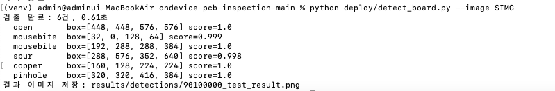

## 2. 같은 보드 — C++ 포팅 버전

```bash
./deploy/cpp/build/detect_board models/mobilenet_v2_int8.onnx $IMG 0.8
```

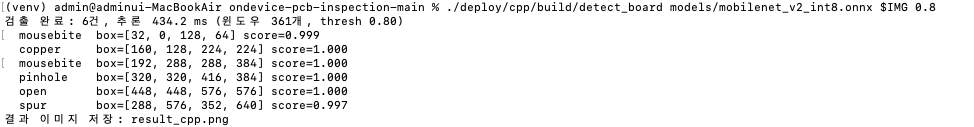

파이썬과 같은 6건을, 박스 좌표까지 동일하게 검출했습니다. (출력 순서만 내부 순회 방식 차이)

캡처 이후 C++ 쪽에 옵션 방식 인자와 단계별 시간 출력을 추가했습니다. 지금 빌드하면
아래 형태로도 실행되고, 출력에 `단계별: 전처리 / 추론 / 후처리` 줄이 하나 더 붙습니다.
(예전 위치 인자 방식도 그대로 동작합니다 — 13번 캡처가 현재 형태입니다)

```bash
./deploy/cpp/build/detect_board --model models/mobilenet_v2_int8.onnx --image $IMG
```

## 3. 모델 벤치마크 (FP32 vs INT8, 테스트 패치 6,140장)

```bash
python src/benchmark.py --models models/*.onnx
```

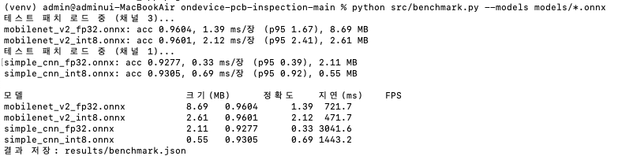

INT8로 크기는 1/4로 줄었지만 x86에서는 오히려 느립니다. INT8의 이득은 NPU/ARM 같은
정수 연산 하드웨어에서 나온다는 것을 보여주는 결과입니다.

## 4. 보드 단위 검출 성능 (테스트 보드 100장)

```bash
python deploy/eval_detection.py --num-boards 100
```

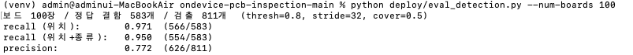

## 5. 검사 결과 TCP 전송 → 모니터링 서버 수신

터미널 두 개로 실행합니다. 캡처는 서버(수신) 쪽 화면입니다.

```bash
python deploy/monitor_server.py --port 5000                  # 터미널 1
python deploy/detect_board.py --image $IMG --send 127.0.0.1:5000   # 터미널 2
```

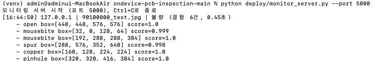

이미지 원본이 아니라 판정 결과 JSON만 전송되므로 대역폭 부담이 거의 없습니다.

## 6~7. ONNX → INT8 TFLite 변환 (NPU 입력 포맷)

```bash
python npu/convert_tflite.py --model simple_cnn
python npu/convert_tflite.py --model mobilenet_v2
```

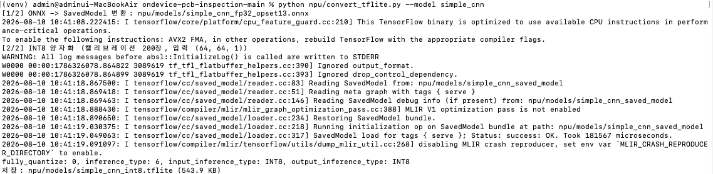
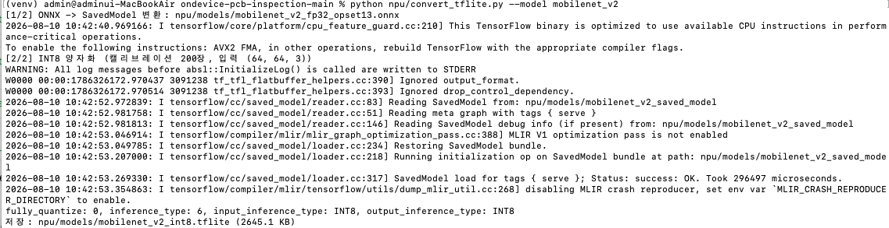

`fully_quantize: 0, input_inference_type: INT8, output_inference_type: INT8` —
입력·출력까지 전부 INT8로 양자화됐다는 뜻이고, Vela가 요구하는 조건입니다.

## 8. ARM Ethos-U(Vela) NPU 컴파일 — 연산 배치와 구성별 성능 추정

```bash
python npu/compile_npu.py
```

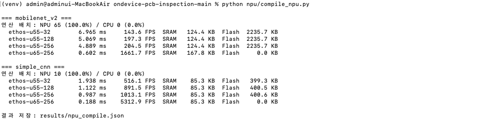

두 모델 모두 CPU 폴백 0. MAC 유닛을 8배(32→256) 늘려도 속도는 2배 미만 → 메모리 대역폭이 병목.

## 9. NPU용 INT8 TFLite 정확도 검증

```bash
python npu/verify_tflite.py --model mobilenet_v2
```

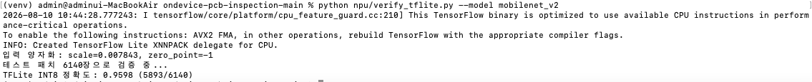

ONNX Runtime INT8(96.01%)과 TFLite INT8(95.98%)이 거의 같아, 툴체인을 바꿔도 동작이
유지되는 것을 확인했습니다.

## 10. QAT vs 대조군(FP32 동일 조건 파인튜닝)

```bash
python src/train_qat.py --epochs 3
```

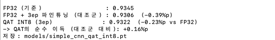

QAT의 순수 이득은 +0.16%p. 이 모델에는 QAT의 추가 복잡도가 정당화되지 않는다는 결론입니다.
이 실험에서는 3 epoch 추가 학습 자체가 손해(-0.39%p)여서, 숫자 하나만 보고 결론 내면
안 된다는 것도 같이 확인했습니다.

## 11. C++ 추론 스레드 수별 벤치마크

```bash
./deploy/cpp/build/detect_board --image $IMG --bench 10
```

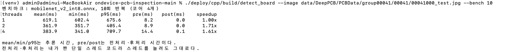

논리 코어는 4개지만 물리 코어가 2개라, 4스레드가 2스레드보다 오히려 느립니다.
임베디드 장비에서 스레드 수는 실측으로 정해야 한다는 것을 보여주는 결과입니다.

## 12. C++ 결과와 파이썬 결과 자동 대조

```bash
python deploy/cpp/compare_with_python.py --num-boards 10 --onnx models/mobilenet_v2_fp32.onnx
```

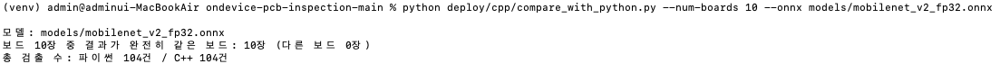

FP32에서는 보드 10장 전부 검출 개수·클래스·박스 좌표까지 동일했습니다.
INT8에서는 일부 보드가 갈리는데, 원인은 모델이 아니라 JPEG 디코더 차이입니다.
(자세한 내용: [deploy/cpp/README.md](../../deploy/cpp/README.md))

## 13. C++ 버전 템플릿 비교 + 박스 정밀화

```bash
./deploy/cpp/build/detect_board --image $IMG --template auto --refine
```

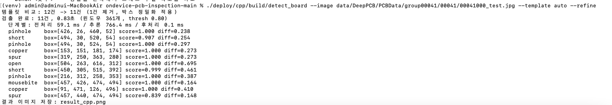

파이썬과 동일한 후처리를 OpenCV 없이 구현했고, 정밀화된 박스 좌표까지 같습니다.

## 14. 논문 기준(IoU≥0.33) 검출 성능

```bash
python deploy/eval_detection.py --use-template --refine --iou 0.33 --num-boards 100
```

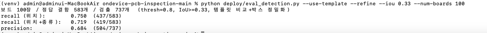

박스 정밀화 없이 IoU 기준으로 재면 recall이 15.6%까지 떨어집니다. 검출 박스가
윈도우 단위(64px 배수)로 나오기 때문인데, 템플릿 차분으로 박스를 좁혀 75.0%가 됐습니다.

## 15~16. 결함 크기별 recall — 단일 스케일 vs 멀티스케일

```bash
python deploy/eval_by_size.py --num-boards 200
python deploy/eval_by_size.py --num-boards 200 --multiscale
```

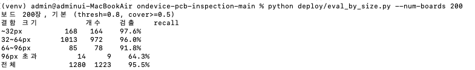
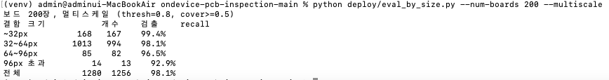

64x64 윈도우 하나에 안 들어오는 큰 결함이 약합니다. 보드를 절반으로 줄여 한 번 더 훑으면
96px 초과 결함 recall이 64.3%(9/14) → 92.9%(13/14), 전체는 95.5% → 98.1%가 됩니다.
모델을 다시 학습하지 않고 얻은 결과입니다. 다만 96px 초과 결함이 200장에 14개뿐이라
이 구간은 표본이 작습니다.
